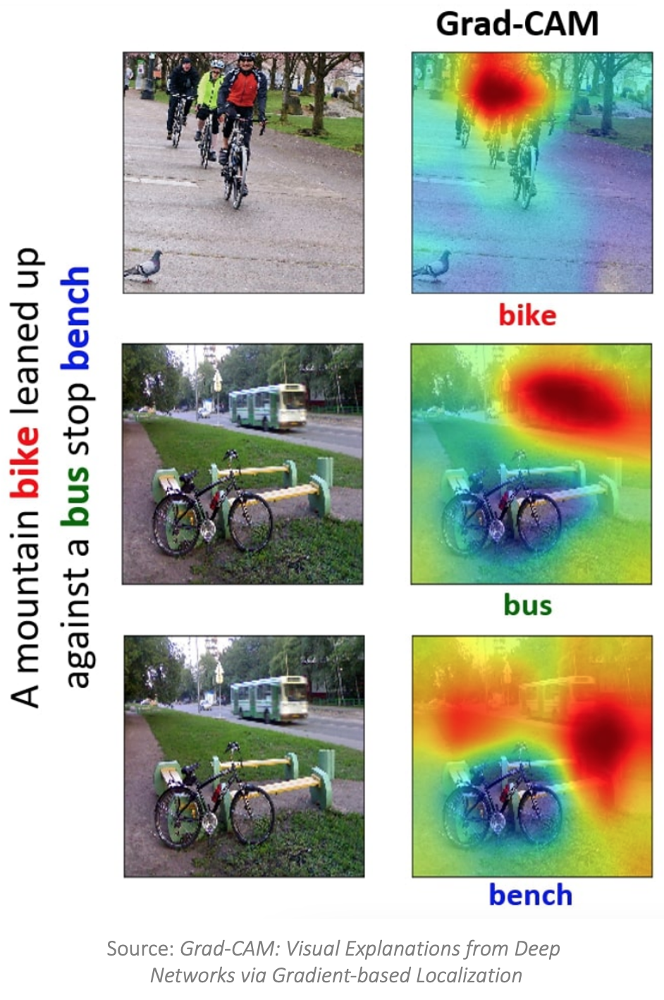
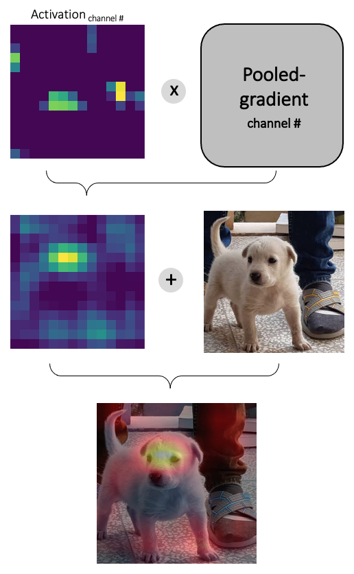
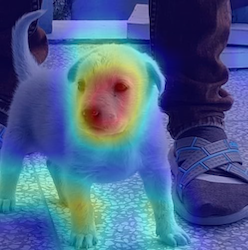

# Gradient-weighted Class Activation Mapping (Grad-CAM)
Have you ever asked yourself, based on what features your deep neural network model performs such that? In other words, which parts of your data were considered more by the model? If so, Grad-CAM has exciting answers for you!

## What is Grad-CAM?
Grad-CAM ([paper](!https://arxiv.org/pdf/1610.02391.pdf)) is a promising AI explainable method used in computer vision. It mainly relies on the gradients flowing from the target class (the predicted class by the model) into the final convolution layer to produce a heatmap localizing the important regions of the input (from the model's point of view).

    

## How does Grad-CAM work?
First, while backpropagating, the gradient of the target score w.r.t the last convolutional layer (feature map) is computed. Next, the gradients are globally-pooled (being channel-wised averaged). The obtained values indicate the importance of each feature map for the target class. Lastly, the ReLU function is applied to the weighted summation of the multiplication of feature maps (also called activations) by the pooled gradients. Finally, it results in a coarse localization map (known as a saliency map) highlighting the regions that maximally activated the model for the target class.

<i>!!! Please note that, according to the original paper, the reason we apply ReLU to the linear combination of the maps is that we are only interested in the features with a positive influence on the target class.</i>

    

## What does this repository contain?
In this repository, I implemented Grad-CAM in Pytorch. At the moment, I used VGG-19 as the backbone (I plan to add more architectures soon). I used the VGG-19 provided by `torchvision` which is already pre-trained on the `ImageNet` database.

Using VGG-19, we store the gradient of the target predicted class score w.r.t the last convolutional layer (which in this case was the 35th layer), compute the Grad-CAM, resize the last feature map to the original image size (VGG-19's final feature map was of size 14x14), and finally combine the obtained map with the original image!

As a test, I fed the picture of my dog to the model and checked the results. Firstly, VGG-19 correctly classified my dog the class 208:Labrador retriever. Furthermore, by inspecting the following results, we can see that the model's main focus has been on the dog's face and paws which resulted in predicting the correct class!

Grad-CAM per each feature map | Grad-CAM for average of all feature maps
:---: | :---:
 | 

## How to run it?
1. Clone and go to the repository:

    `git clone https://github.com/behzadshomali/Grad_CAM_Pytorch.git ; cd Grad_CAM_Pytorch`

2. Create and activate a virtual environment

    `python3 -m venv <VIRTUALENV_NAME> ; source <VIRTUALENV_NAME>/bin/activate`

3. Install the dependencies:

    `pip3 install -r requirements.txt`

4. Run the program by passing the desired image path:

    `python3 main.py <PATH_TO_IMAGE>`

<i>!!! You can see all the available arguments by running `python3 main.py -h` in your terminal.</i>
